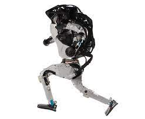

## Atlas
Atlas is a bipedal humanoid robot primarily developed by the American robotics company Boston Dynamics with funding and oversight from the U.S. Defense Advanced Research Projects Agency (DARPA). The robot was initially designed for a variety of search and rescue tasks, and was unveiled to the public on July 11, 2013.

#### Design and development
The design and production of Atlas was overseen by DARPA, an agency of the United States Department of Defense, in cooperation with Boston Dynamics. 

#### Applications

In the 2015 DARPA competition of robotics, Atlas was able to complete all eight tasks as follows:

1. Drive a utility vehicle at the site.
2. Travel dismounted across rubble.
3. Remove debris blocking an entryway.
4. Open a door and enter a building.
   
* Climb an industrial ladder and traverse an industrial walkway.
* Use a tool to break through a concrete panel.
* Locate and close a valve near a leaking pipe.
* Connect a fire hose to a standpipe and turn on a valve.

> Atlas is intended to aid emergency services in search and rescue operations, performing tasks such as shutting off valves, opening doors and operating powered equipment in environments where humans could not survive.[1] The Department of Defense stated in 2013 that it had no interest in using the robot for offensive or defensive warfare.

#### Reactions
**Atlas was unveiled to the public on July 11, 2013.** The New York Times said that its debut was "a striking example of how computers are beginning to grow legs and move around in the physical world", describing the robot as "a giant – though shaky – step toward the long-anticipated age of humanoid robots." Gary Bradski, a specialist in artificial intelligence, declared that *"a new species, Robo sapiens, are emerging"*.

~~aaaa~~

## Reference
[Atlas (robot) wikipedia]([http://](https://en.wikipedia.org/wiki/Atlas_(robot)))

[My Readme](./template.md)

| Tables        | Are           | Cool  |
| ------------- |:-------------:| -----:|
| col 3 is      | right-aligned | $1600 |
| col 2 is      | centered      |   $12 |
| zebra stripes | are neat      |    $1 |